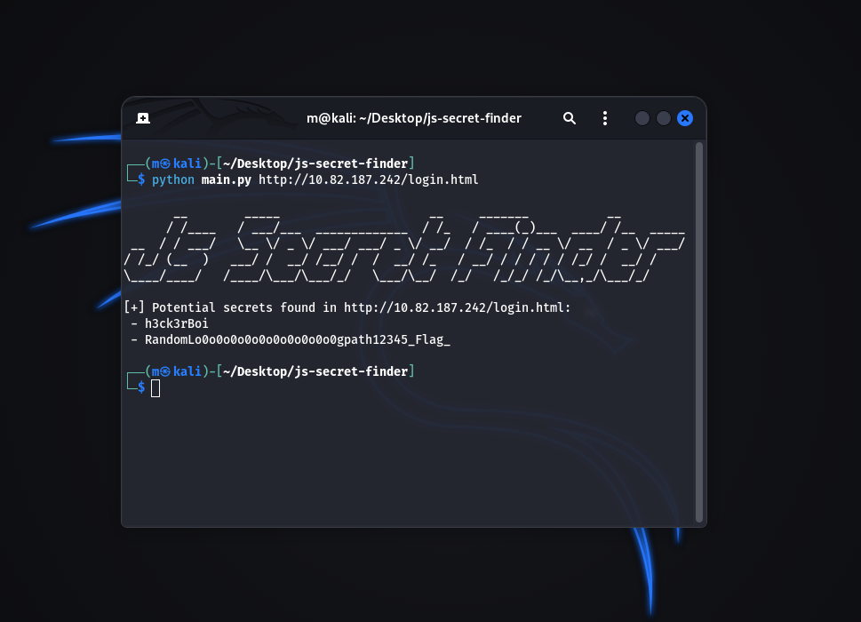

# JS Secret Finder



JS Secret Finder is a simple Python tool that scans JavaScript files for exposed
client-side authentication logic and suspicious hardcoded values that may lead
to sensitive information disclosure.

## Features
- Detects hardcoded values in client-side comparisons (`==`, `===`)
- Finds suspicious hardcoded strings (e.g. credentials, tokens, paths)
- Deduplicated and clean output
- Writes results to a file for reporting

## Requirements
- Python 3.9+
- `requests` library

Install dependencies:
```bash
pip install requests
```
## Usage
Basic usage (results are written to `output.txt` by default)
```bash
python main.py https://example.com/app.js
```
Specify a custom output file:
```bash
python main.py https://example.com/app.js --output findings.txt
```
Show help:
```bash
python main.py -h
```

## Output
The tool prints findings to the terminal and writes them to the output file.

Example: 

```
[+] Potential secrets found in https://example.com/app.js:
 - h3ck3rBoi
 - 54321@terceSrepuS
 - RandomLo0o0o0o0o0o0o0o0o0o0gpath12345_Flag_

```

## Disclaimer
This tool is intended for educational purposes and authorized security testing only.Use it only on systems you own or have explicit permisson to test.
